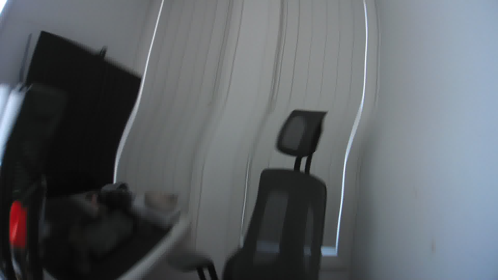
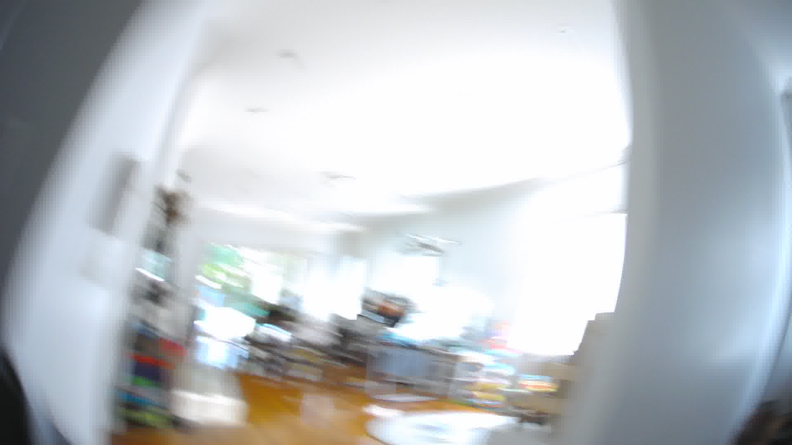

# Coding Procedures

## Process for Coding an Image

1. To gain an understanding of what is happening in the image, flick through the screen exposure episode.
2. Determine if the image is codable or contains a screen exposure.
   If the image is codable, continue coding the image.
   If the image is uncodable or does not include a screen exposure, then code the image as uncodable or No screen exposure and move on to the next image.
3. Code the image for location
4. Code the image for number of devices
5. Code the image for devices1 and device 2
6. Code the image for content1 and content2
7. Code the image for the social setting
8. Code the image for associated behaviours

## Additional Information

* Only code images that have an active screen device present in the image (unless determined as a Not in Frame image following the coding rules).
  Do not code for inactive screen devices.
* If something is coded for as *Other*, try to include as much information as possible in the notes cell of that row explaining why it was coded as *Other*.
* Flick through images prior to coding a screen exposure episode to gain an understanding of what is happening in the episode.
  Doing this will make it easier to code.
  An image may be coded based on what is occurring in the images prior and after the image.
* When coding, look at different cues in the image to determine the most appropriate code.
* Cues for food may include seeing a plate on the dinner table or coffee table, seeing a fridge in the images leading up to the screen exposure.
* Cues for screen exposure when a screen device is not present in the image include seeing other people in the room looking in the direction of the screen-based media device or the participant sitting in the same position for a long period of time.
* Cues for screen exposure during ceiling images include light on ceiling changing in each image or arms positions in a way that they are most likely holding a device.
* If someone in the background is using a screen-based media device do not code this as screen exposure if the participant cannot see the screen of the device.
  Only code a device as a screen exposure of the participant can see the screen of the device.

## No Screen Exposure

Any image or set of images where an active screen-based media device is not visible in the image.
Image/s can only be coded if an active (turned ‘on’) screen-based media is visible in the image.
Inactive screen-based media devices have a dark or locked screen or the device’s screen is not visible in the image.

<figure markdown>
  { width="500" data-description="Even though a screen is visible, this would be coded as no screen exposure because the device is off." }
  <figcaption markdown>Example: No screen exposure</figcaption>
</figure>

## Uncodable Images

Uncodable images are images that cannot be confidently annotated due to image quality.
Uncodable images should be coded as *uncodable*, with the reason why the image or set of images are uncodable.

Images should only be coded as uncodable if all aspects of the image or set of images can not be confidently determined (i.e., if the context of the image is dark but you can still code the device and content, the image is not uncodable).

Reasons for an image to be classified as uncodable are listed below.

## Non-wear Time

In some cases, a participant may remove the camera but forget to turn it off.
This might be indicated by a series of images that are all the same, or images being captured from a position that would not be possible if the camera was being worn (e.g., the camera is sitting on a table).
These images should be coded as *non-wear time*.

### Blurry

Any image or set of images where the image quality is so poor due to being blurred the coder is unable to confidently determine what is occurring in all aspects of the image.

<figure markdown>
  { width="500" data-description="An example of an image that would be coded as uncodable because it is blurry. If you could confidently identify an active device, you could still code the image." }
  <figcaption markdown>Example: Blurry</figcaption>
</figure>

### Poor Lighting

Any image or set of images where the image quality is so poor due to lighting the coder is unable to confidently determine what is occurring in all aspects of the image.
Poor lighting can include images that are too dark or too overexposed to accurately code.

<figure markdown>
  { width="500" data-description="An example of an image that would be coded as uncodable because it is overexposed." }
  <figcaption markdown>Example: Lighting</figcaption>
</figure>

### Blocked

Images that are completely black or fully blocked by something and cannot be coded as having an active screen-based media device according to the coding rules.
Includes completely blacked images.

<figure markdown>
  { width="500" data-description="An example of an image that would be coded as uncodable because it is blocked." }
  <figcaption markdown>Example: Blocked</figcaption>
</figure>
