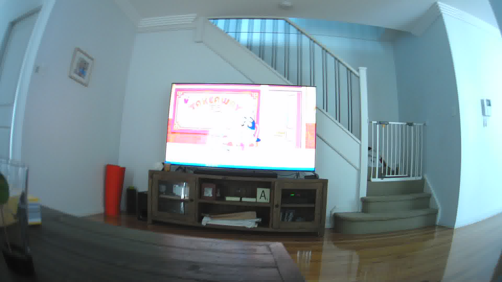
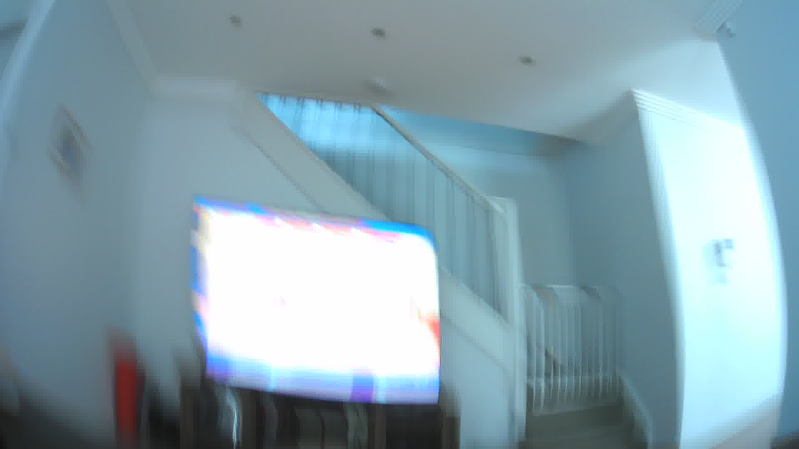
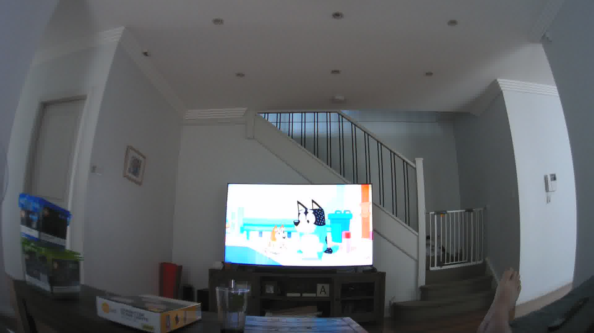
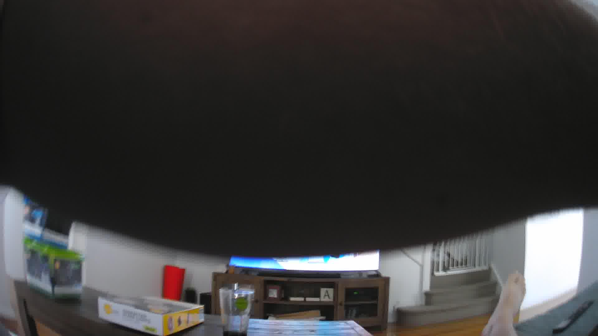
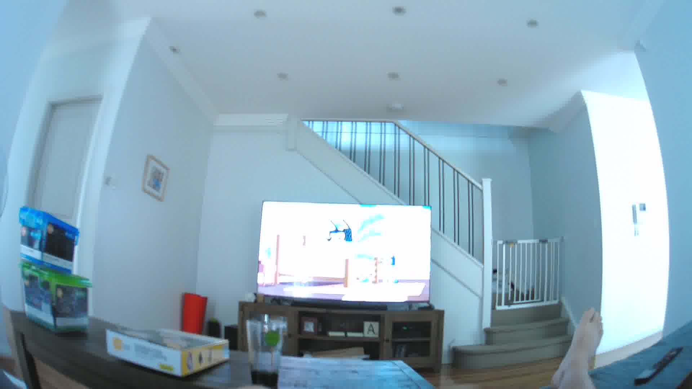
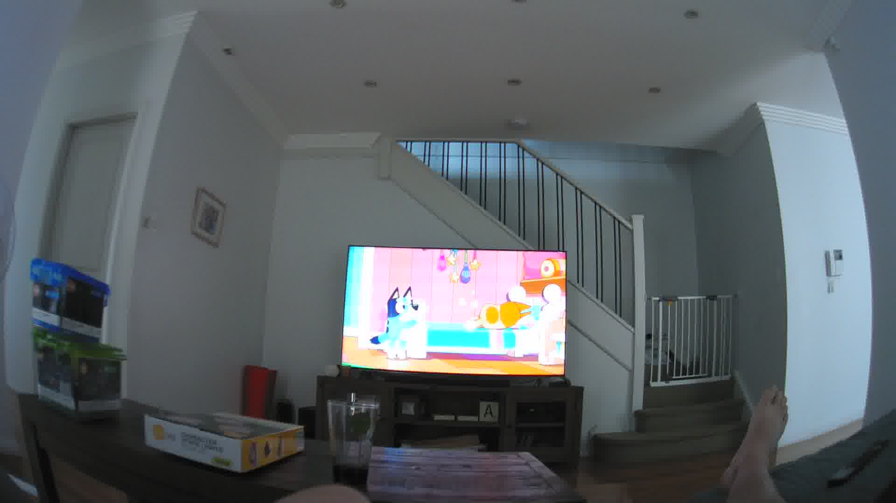

# Coding Rules

These are the general 'rules' to follow when coding images.
They're intended to minimise the differences between coders, such that we all end up making similar decisions.
Some of these rules may not make sense until you have also familiarised yourself with the codebook and coding procedures.

???+ tip

    Click the images below to see how they should be coded.

## 1. Image Coding Order

Each image must be coded in chronological order as indicated by the image number.

<!-- TODO: Clarify this rule... Why does this matter? -->

## 2. Fully Blocked Images

A fully blocked image (e.g., the camera is blocked by a blanket) or a series of fully blocked images (e.g., multiple images blocked by a blanket) can be coded for screen exposure if the image before and after the series of blocked images show the same screen device in the same location.
Fully blocked images that can be coded as screen exposure must be coded as *Not in Frame* with the same device, content and context coded as the first image that was not blocked.

To code an image as *Not in Frame* do not include it in the Number of Devices in image code.

<figure markdown>
  { width="500" data-description=".fully-blocked-desc1" }
  { width="500" data-description=".fully-blocked-desc2" }
  { width="500" data-description=".fully-blocked-desc3" }
  <figcaption markdown>**Example:** Fully blocked sequence</figcaption>
</figure>

  
First image in a sequence of fully blocked images. Coded as:

  
<strong># Devices in Image:</strong> 1 
  <strong>Device1:</strong> Television  
  <strong>Location:</strong> Living Room 

  
An example of a blocked image. There could be several of these before the next unblocked image. Coded as:

  
<strong># Devices in Image:</strong> 0 (the device is not visible) 
  <strong>Device1:</strong> Television  
  <strong>Location:</strong> Living Room 

  
An example of an image at the end of a sequence of fully blocked images. Coded as:

  
<strong># Devices in Image:</strong> 1 
  <strong>Device1:</strong> Television  
  <strong>Location:</strong> Living Room 

## 3. Partially Blocked Images

A partially blocked image (e.g., when a hand blocks some of the camera hiding the device) or a series of partially blocked images follows the same rule as fully blocked images.
A partially blocked image can be coded as screen exposure if the image before and after the blocked image show the same screen device in the same location.
Partially blocked images that can be coded as screen exposure must be coded as *Not in Frame*.
Partially blocked images are to be coded as the same as the previous image (e.g., if a screen is blocked, the partially blocked image would be coded as the same device and content as the image prior).

???+ note

    If the only image of a screen exposure is one that is partially blocked, and you are not confident in what the device is, you can always code the device as *Unclassifiable*.

<figure markdown>
  { width="500" data-description=".partial-blocked-desc1" }
  { width="500" data-description=".partial-blocked-desc2" }
  { width="500" data-description=".partial-blocked-desc3" }
  <figcaption markdown>**Example:** Partially blocked sequence</figcaption>
</figure>

  
First image in a sequence of partially blocked images. Coded as:

  
<strong># Devices in Image:</strong> 1 
  <strong>Device1:</strong> Television  
  <strong>Location:</strong> Living Room 

  
An example of a partially blocked image. There could be several of these before the next unblocked image. Coded as:

  
<strong># Devices in Image:</strong> 0 (the device is not visible) 
  <strong>Device1:</strong> Television  
  <strong>Location:</strong> Living Room 

  
An example of an image at the end of a sequence of partially blocked images. Coded as:

  
<strong># Devices in Image:</strong> 1 
  <strong>Device1:</strong> Television  
  <strong>Location:</strong> Living Room 

## 4. Context Rule

Due to the camera’s ability to only be able to capture what is in front of the participant, some images may not capture the complete context of the image (e.g., where the participant is located, who the participant is with, other behaviours the participant is undertaking during screen exposure).
Coders can look at the whole screen exposure episode before coding the image to gain context of the image.

## 5. Ceiling Images

Ceiling images are when the camera is pointed at the ceiling with no device visible in the image.
Ceiling images most often occur when a participant is lying on their back or in a leaned back sitting position, which are also common body positions taken when using a screen device.
A ceiling image can be coded as screen exposure if an image before and after the ceiling image show the same screen-based media device in the same location and the participant does not move to another room or if the context remains the same and the coder is more than 50% certain that the participant is using a screen device.
Ceiling images that can be coded as screen exposure must be coded as *Not in Frame*.
If the device, content or context is not visible in the image, it should be coded the same as the image prior.

<figure markdown>
  { width="500" data-description=".ceiling-desc1" }
  { width="500" data-description=".ceiling-desc2" }
  { width="500" data-description=".ceiling-desc3" }
  <figcaption markdown>**Example:** Fully blocked sequence</figcaption>
</figure>

  
First image in a sequence of ceiling images. Coded as:

  
<strong># Devices in Image:</strong> 1 
  <strong>Device1:</strong> Television  
  <strong>Location:</strong> Living Room 

  
An example of a ceiling image. There could be several of these before the next codable image. Coded as:

  
<strong># Devices in Image:</strong> 0 (the device is not visible) 
  <strong>Device1:</strong> Television  
  <strong>Location:</strong> Living Room 

  
An example of an image at the end of a sequence of ceiling images. Coded as:

  
<strong># Devices in Image:</strong> 1 
  <strong>Device1:</strong> Television  
  <strong>Location:</strong> Living Room 

