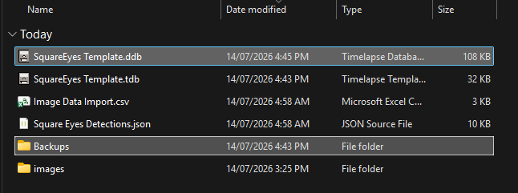

# Finishing Up

Once you've finished coding all of the images, we need to make sure that everything is stored correctly.

### Step 1: Copy the database file and Backups folder to SharePoint

- ##### 1.1. Open the SharePoint folder for the participant

    ---

    You can follow the steps for [downloading the images](./setup.md#step-2-download-the-participant-data) to get to the SharePoint folder for the participant.

    !!! warning
        Make sure that you are in the correct folder.
        It needs to be the folder for the right participant, and for the right timepoint.

- ##### 1.2 Copy ONLY the database file and Backups folder to SharePoint

    ---

    You should only copy the *SquareEyes Template.<mark>ddb</mark>* (**NOT** the *SquareEyes Template.<mark>tdb</mark>*) and the `Backups` folder to SharePoint.
    Do not copy the `images` folder or any other files to SharePoint, as it risks corrupting the other data.

    You can just drag and drop the files into the SharePoint folder, or you can copy and paste them.

    <figure markdown>
      { width="100%" }
      <figcaption markdown>The files/folder to move to SharePoint</figcaption>
    </figure>

### Step 2: Delete all local files

You must delete both the `Images.zip` file and the extracted folder from the local machine.

### Step 3: Mark the timepoint as complete in Asana

Mark the task you [previously allocated to yourself](setup.md#step-1-assign-yourself-to-images-in-asana) as complete.
Please don't delete the task as these are sometimes used for tracking what has been completed.
