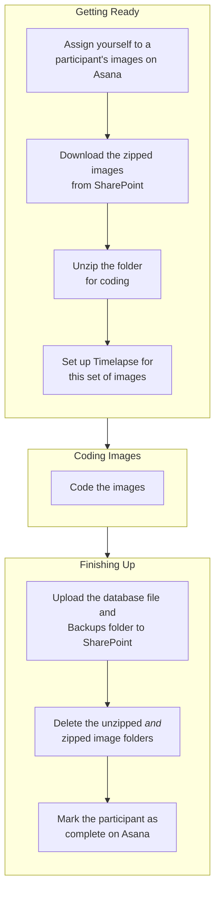

# Overview

## Workflow Overview

The diagram below shows the full workflow for coding a participant's images, from assigning yourself on Asana through to marking the participant as complete.

The rest of this section details how to do each of these steps.
