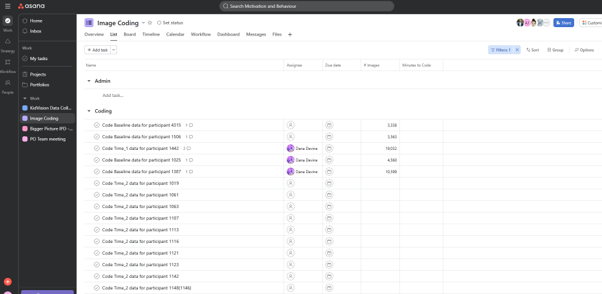
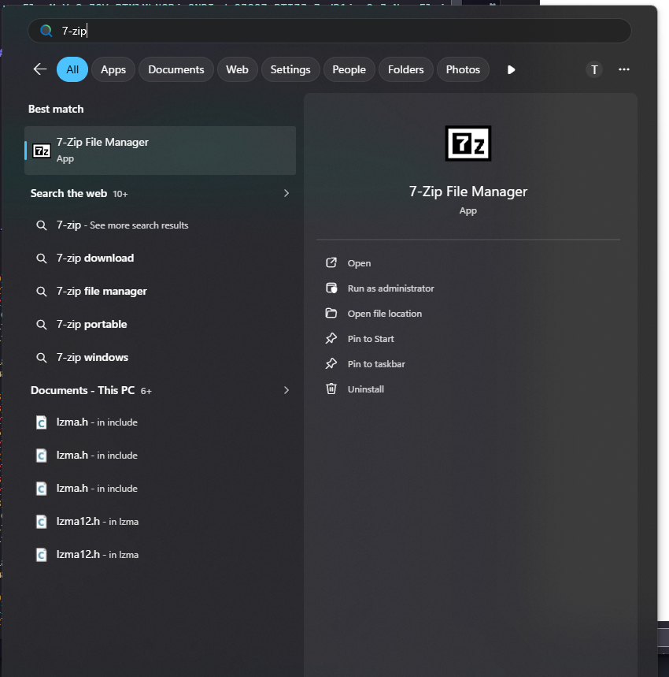
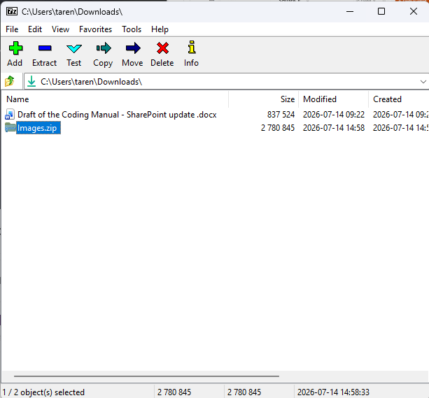
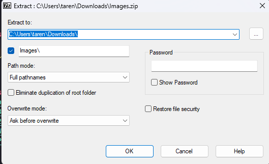
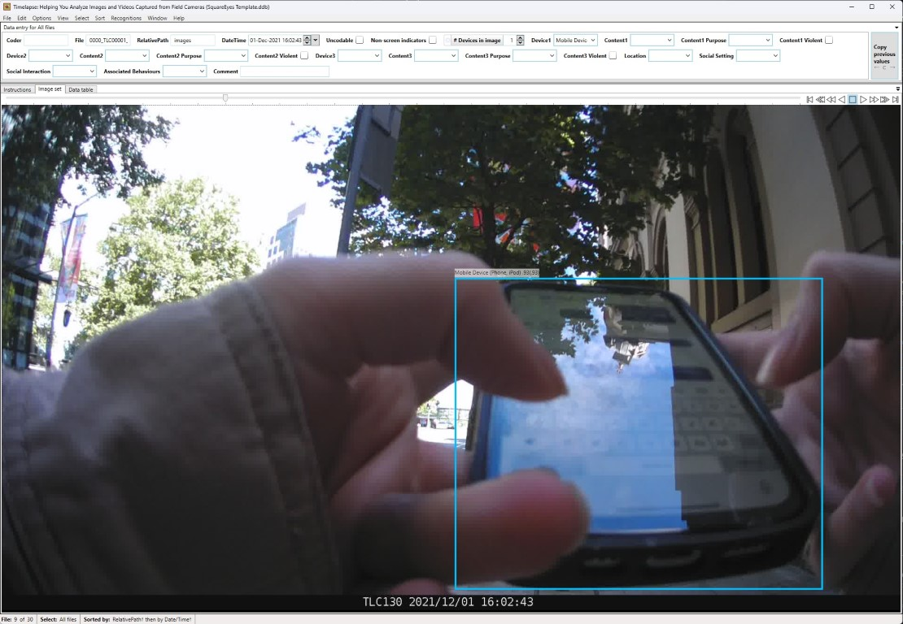
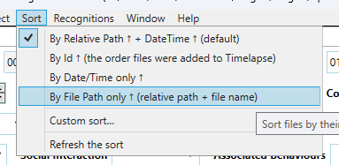

# Getting Ready

Let's look at how to load up images and annotations in Timelapse so that you can code data.

???+ tip

    It's a good idea to follow along with these instructions.
    
    There is an example folder available on the SharePoint Site at `.../Square_Eyes_DP20_Data/Practice Data/0000`. Please **make a copy** of this data in the same folder, and use the copy to follow along with these instructions.

## Step 1: Assign Yourself to Images in Asana

???+ warning
    **Please don't skip this step.**

    We have more people coding than we have in the past, increasing the risk of two people coding the same images.
    Marking yourself as the coder for a participant's images in Asana is the only way to prevent this from happening.

<figure markdown>
  { width="100%" }
  <figcaption markdown>View of Asana project</figcaption>
</figure>

This step is pretty straightforward: pick any unassigned participant timepoint, and assign it to yourself by clicking inside the `Assignee` field and selecting your name.
There is no need to set a due date.

Generally speaking, we prioritise coding baseline data first, but if you want to code a later timepoint that's fine too.

## Step 2: Download the Participant Data

Navigate to the [Square Eyes SharePoint site](https://myacu.sharepoint.com/sites/SquareEyes).

<div class="grid cards" markdown>

- ##### 2.1. Navigate to the SquareEyes Data Folder on SharePoint

    ---

    

    You can also just follow [this link](https://myacu.sharepoint.com/sites/SquareEyes/Square_Eyes_DP20_Data).

- ##### 2.2. Click on Participant_Data

    ---

    

- ##### 2.3. Click on Main Study

    ---

    

- ##### 2.4. Click on Community Sample

    ---

    

- ##### 2.5. Click on the ID of the Participant

    ---

    

- ##### 2.6. Click on the Timepoint

    ---

    

- ##### 2.7. Right Click on the Images folder and click on Download

    ---

    

</div>

## Step 3: Unzip the Downloaded Folder

The zip folder should be called `Images.zip`.
If it isn't, it likely means that you downloaded the wrong folder.

While unzipping with Windows sometimes works, it can be a bit unreliable.
We recommend using [7-Zip](../software/other_software.md#7-zip) to unzip the folder.

It is fine to unzip the folder in the same location as the zip file, but make sure that you don't unzip it into a folder that is synced (e.g., OneDrive).

<div class="grid cards" markdown>

- ##### 3.1. Open 7-Zip

    ---

    

- ##### 3.2. Select the Images.zip file and click Extract

    ---

    

- ##### 3.3. Click OK to confirm the extraction location

    ---

    

</div>

### Folder Structure

Let's take a second to look at the folder structure of the Images folder.

```text
Images/
├── .converted
├── Image Data Import.csv
├── Square Eyes Detections.json
├── SquareEyes Template.tdb
└── images/
    ├── 0000_TLC00001_00001.jpg
    ├── 0000_TLC00001_00002.jpg
    ├── 0000_TLC00001_00003.jpg
    ├── 0000_TLC00001_00004.jpg
    └── 0000_TLC00001_00005.jpg
```

Inside are four important files and a folder.

| Item | Description |
| ------ | ------------- |
| `.converted` | This is a hidden file that confirms the machine learning processing is complete. |
| `Image Data Import.csv` | This contains the machine learning predictions. |
| `Square Eyes Detections.json` | This contains the annotations, which helps by drawing boxes around points of interest in the image. |
| `SquareEyes Template.tdb` | It contains all of the fields that you'll be coding |
| `images` | This is the folder that contains the actual participant images. |

???+ note

    If you come across a folder that's missing some of these files, [let the team know](../index.md#key-contacts).
    It probably means that folder hasn't been processed yet.

## Step 4: Setup Timelapse for Coding

<div class="grid cards wide" markdown>

- ##### 4.1 Load the Timelapse Template

    ---

    Start by opening Timelapse, the click on `File > Load template, images, and video files...`.
    Navigate to the folder of the participant you're coding, and select the `SquareEyes Template.tdb` file.[^1]

    When you do this, Timelapse has to generate a database for the images.
    If there are a lot of images, this can take a minute or two.

    [^1]:
        Some of these videos have been trimmed or sped up.
        It will almost certainly take longer when you are doing it.

    <iframe src="https://www.loom.com/embed/6c943f72c6eb4a8c83cc722ac9f163db?sid=58e05f0b-bf48-4c79-8b44-d6cadc7220e1" frameborder="0" webkitallowfullscreen mozallowfullscreen allowfullscreen style="width: 100%; aspect-ratio: 100 / 68.54; border: 0;"></iframe>

- ##### 4.2. Import the Pre-coded Data

    ---

    Next, we need to import the pre-coded data.
    Click on `File > Import data from a .csv file...`.
    Navigate to the folder of the participant you're coding, and select the `Image Data Import.csv` file.

    <iframe src="https://www.loom.com/embed/c19b9eb871554d93be21a2912ae4760c?sid=2b14068a-63a4-41db-a779-a8c736205ecd" frameborder="0" webkitallowfullscreen mozallowfullscreen allowfullscreen style="width: 100%; aspect-ratio: 100 / 67.67; border: 0;"></iframe>

- ##### 4.3 Load the Annotations

    ---

    Now we can load the annotations.
    This is not strictly nessassary, but it's very helpful in determining why something was precoded.

    Click on `Recognitions > Import image recognition data for this image set...`.
    Navigate to the folder of the participant you're coding, and select the `Square Eyes Detections.json` file.

    <iframe src="https://www.loom.com/embed/b95dfeffcaa849dda6d2ffd67b85131e?sid=9c681b10-5fe8-4383-82a4-2f7d2884db66" frameborder="0" webkitallowfullscreen mozallowfullscreen allowfullscreen style="width: 100%; aspect-ratio: 100 / 67.67; border: 0;"></iframe>

    Once it's done, you should see boxes on some of the images.
    For example, image 9 of the practice set should look like the below.

    <figure markdown>
      { width="100%" }
      <figcaption markdown>**Example:** An annotated image</figcaption>
    </figure>

- ##### 4.4 Set the Image Order

    ---

    The new version of Timelapse no longer allows missing timestamps.
    One of the side effects of this is that the images may not be in the correct order.
    We therefore need to make sure we manually set the image order.
    To set this, click on `Sort > By File Path only...`.

    <figure markdown>
      { width="100%" }
      <figcaption markdown>How to sort images in Timelapse</figcaption>
    </figure>

- ##### 4.5 Configure the Bounding Box Confidence Threshold

    ---

    This step is optional.
    By default, bounding boxes are only shown around objects with a confidence of 0.5 or higher.
    This is a bit high for our purposes.

    To change this, click on `Recognitions > Set bounding box options...`.
    Then, change the confidence slider to around 0.3.

    <iframe src="https://www.loom.com/embed/f772d0b9d0d04c36b5cce86316747c24?sid=db009e57-1171-4229-95d7-9ef62eea5c00" frameborder="0" webkitallowfullscreen mozallowfullscreen allowfullscreen style="width: 100%; aspect-ratio: 100 / 67.65; border: 0;"></iframe>

</div>
