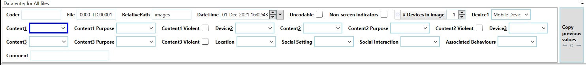

# Coding Images

With everything setup, you're now ready to start coding.
This section outlines some of the methods you can use to increase your coding speed.
It also gives some common pitfalls and how to avoid them.

## Basic Coding

You complete the coding by filling in the fields across the top of the template.
You should fill in every field that you can, but it is fine to leave irrelevant fields blank.
For example, if there is only one device in the image you do not need to enter anything for Device2 or Device3.
You also only need to complete the fields when there is a device present (or inferred by a coding rule).

<figure markdown>
  { width="100%" }
  <figcaption markdown>The coding fields</figcaption>
</figure>

Note that you don't need to do anything to save your progress.
Changes are automatically saved as you go.

### Copy Previous

The button on the right of the fields allows you to copy all of the fields from the previous image.
Most screen exposures will have the same device and content as the previous image, so this can save a lot of time.[^1]

[^1]:
    Don't pay too much attention to the codes used in these videos.
    They're just meant to show the features, and some of the codes will be wrong.

<iframe src="https://www.loom.com/embed/dbc8a2f8786947b8a7b60fa5dfb935fa?sid=b161fe25-eb3b-4544-a197-08df68b4d148" frameborder="0" webkitallowfullscreen mozallowfullscreen allowfullscreen style="position: absolute; top: 0; left: 0; width: 100%; height: 100%;"></iframe>

### Copy to All

You can also copy a field to all images.
This is really only handy for filling in the coder name.

<iframe src="https://www.loom.com/embed/3023bc902bbe4fbc96c3637a06331084?sid=be904eba-a4fb-4419-b061-11cee5a4b666" frameborder="0" webkitallowfullscreen mozallowfullscreen allowfullscreen style="position: absolute; top: 0; left: 0; width: 100%; height: 100%;"></iframe>

### QuickPaste

You'll often find that participants engage in the same behaviours repeatedly, sometimes with short breaks in between.
Timelapse has a built-in function to help with this called QuickPaste.
QuickPaste lets you copy the codes from an image, and apply it on one or multiple images.
You can make as many of these as you want.[^2]

[^2]:
    You should give them proper names though, so you know what they do.

<iframe src="https://www.loom.com/embed/e51565dbcd2b4dbba618d2136712bb6f?sid=7c1021a7-1967-4330-bb40-8e2cbd70705f" frameborder="0" webkitallowfullscreen mozallowfullscreen allowfullscreen style="position: absolute; top: 0; left: 0; width: 100%; height: 100%;"></iframe>

### Zooming Out and Coding Multiple

One of the best features in Timelapse is that you can code multiple images with the same codes all at once.
To do this, start by zooming out using your mouse scroll wheel.
You can then select multiple images, either by holding ++ctrl++ and selecting images, or by clicking on the first image and then holding ++shift++ and clicking on the last image.

<iframe src="https://www.loom.com/embed/ad7ba7d134374c15a28634c2fdef10b0?sid=fd9aaaad-cacf-427d-8c8c-78f1af24b772" frameborder="0" webkitallowfullscreen mozallowfullscreen allowfullscreen style="position: absolute; top: 0; left: 0; width: 100%; height: 100%;"></iframe>

### Filtering

As part of the machine learning process, the model identifies which images need to be screened.
This includes images that don't have a screen detected when a screen was detected in a previous image.

To use this, you need to filter for images that have been tagged as needing screening.
Click on `Select > Custom selection...` then filter for 'Requires screening' = :material-checkbox-marked:.

<iframe src="https://www.loom.com/embed/514b6654eddf465bb8ecece4c1e4c66d?sid=0aaae525-efce-45ea-a754-f3c7771b4521" frameborder="0" webkitallowfullscreen mozallowfullscreen allowfullscreen style="position: absolute; top: 0; left: 0; width: 100%; height: 100%;"></iframe>

It's completely fine to just code these images.
But, you might consider filtering for the opposite to check that nothing was missed.

## Common Mistakes

### Not Checking the Device Order

The machine learning model orders the devices by how confident it is in the prediction.
But, this can mean that Device1 is just the most prominent device, and not the device receiving the most attention.
This can vary even across similar looking images, so pay attention to which device has been put in which field.

### Not Clearing Erroneous Predictions

It's easy to skip over images that obviously don't contain screens.
But, make sure that there is not an erroneous prediction from the machine learning model on this image, because it will get mixed into the results.
A good option is to make a 'clear' [QuickPaste](#quickpaste) code to quickly clear these images.
