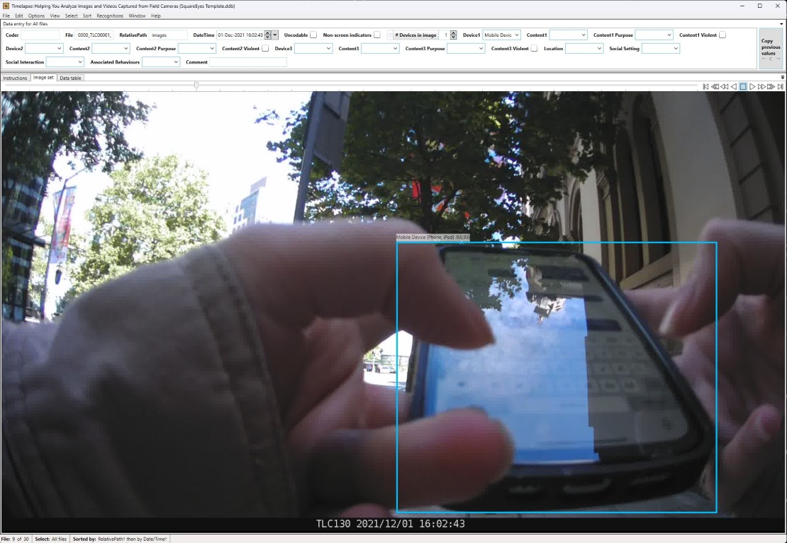

# Setup

Let's look at how to load up images and annotations in Timelapse so that you can code data.

???+ tip

    It's a good idea to follow along with these instructions.
    
    There is an example folder available on the network drive at `.../Square_Eyes_DP20_Data/Practice Data/0000`. Please **make a copy** of this data in the same folder, and use the copy to follow along with these instructions.

## Folder Structure

All participant data will have the same folder structure as the example data.

```text
+---0000
|   \---Baseline
|       \---Images
|           |   .converted
|           |   Image Data Import.csv
|           |   Square Eyes Detections.json
|           |   SquareEyes Template.tdb
|           |   
|           \---images
|                   0000_TLC00001_00001.jpg
|                   0000_TLC00001_00002.jpg
|                   0000_TLC00001_00003.jpg
|                   0000_TLC00001_00004.jpg
|                   0000_TLC00001_00005.jpg
|                   ...
|                   
```

The top level folder (`0000`) is the participant ID.
Each participant has their own folder.

Under that will be a folder for each time point.
The first of these is `Baseline`, and it might be the only one that's the stage the participant is up to.

Under each time point folder is an `Images` folder.
Inside are three important files:

* `Image Data Import.csv` - This contains the machine learning predictions.
  We'll explain that a bit later.
* `Square Eyes Detections.json` - This contains the annotations.
  More simply - this helps by drawing boxes around points of interest in the image.
* `SquareEyes Template.tdb` - This is the Timelapse template file.
  It contains all of the fields that you'll be coding.

???+ note

    If you come across a folder that's missing some of these files, [let the team know](../index.md#key-contacts).
    It probably means that folder hasn't been processed yet.

Finally, there's a folder that contains the images (`images`).

## Loading Images and Annotations

There are four steps before you start coding:

1. Load the timelapse template.
2. Import the pre-coded data.
3. Load the annotations.
4. Configure the settings.

### Load the Timelapse Template

Start by opening Timelapse, the click on `File > Load template, images, and video files...`.
Navigate to the folder of the participant you're coding, and select the `SquareEyes Template.tdb` file.[^1]

[^1]:
    Some of these videos have been trimmed or sped up.
    It will almost certainly take longer when you are doing it.

<div style="position: relative; padding-bottom: 68.54043392504931%; height: 0;"><iframe src="https://www.loom.com/embed/6c943f72c6eb4a8c83cc722ac9f163db?sid=58e05f0b-bf48-4c79-8b44-d6cadc7220e1" frameborder="0" webkitallowfullscreen mozallowfullscreen allowfullscreen style="position: absolute; top: 0; left: 0; width: 100%; height: 100%;"></iframe></div>

When you do this, Timelapse has to generate a database for the images.
If there are a lot of images, this can take a minute or two.

### Import the Pre-coded Data

Next, we need to import the pre-coded data.
Click on `File > Import data from a .csv file...`.
Navigate to the folder of the participant you're coding, and select the `Image Data Import.csv` file.

<div style="position: relative; padding-bottom: 67.66917293233082%; height: 0;"><iframe src="https://www.loom.com/embed/c19b9eb871554d93be21a2912ae4760c?sid=2b14068a-63a4-41db-a779-a8c736205ecd" frameborder="0" webkitallowfullscreen mozallowfullscreen allowfullscreen style="position: absolute; top: 0; left: 0; width: 100%; height: 100%;"></iframe></div>

### Load the Annotations

Now we can load the annotations.
This is not strictly nessassary, but it's very helpful in determining why something was precoded.

Click on `Recognitions > Import image recognition data for this image set...`.
Navigate to the folder of the participant you're coding, and select the `Square Eyes Detections.json` file.

<div style="position: relative; padding-bottom: 67.66917293233082%; height: 0;"><iframe src="https://www.loom.com/embed/b95dfeffcaa849dda6d2ffd67b85131e?sid=9c681b10-5fe8-4383-82a4-2f7d2884db66" frameborder="0" webkitallowfullscreen mozallowfullscreen allowfullscreen style="position: absolute; top: 0; left: 0; width: 100%; height: 100%;"></iframe></div>

Once it's done, you should see boxes on some of the images.
For example, image 9 of the practice set should look like the below.

<figure markdown>
  { width="100%" }
  <figcaption markdown>**Example:** An annotated image</figcaption>
</figure>

### Configure the Settings

This step is optional.
By default, bounding boxes are only shown around objects with a confidence of 0.5 or higher.
This is a bit high for our purposes.

To change this, click on `Recognitions > Set bounding box options...`.
Then, change the confidence slider to around 0.3.

<div style="position: relative; padding-bottom: 67.65285996055226%; height: 0;"><iframe src="https://www.loom.com/embed/f772d0b9d0d04c36b5cce86316747c24?sid=db009e57-1171-4229-95d7-9ef62eea5c00" frameborder="0" webkitallowfullscreen mozallowfullscreen allowfullscreen style="position: absolute; top: 0; left: 0; width: 100%; height: 100%;"></iframe></div>
